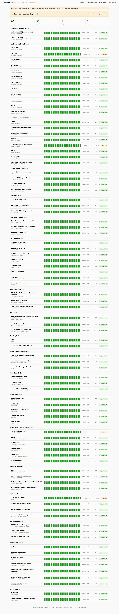
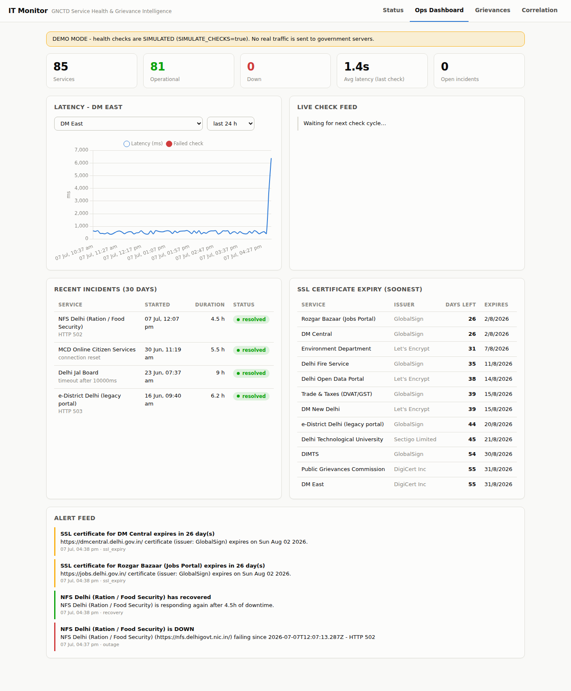
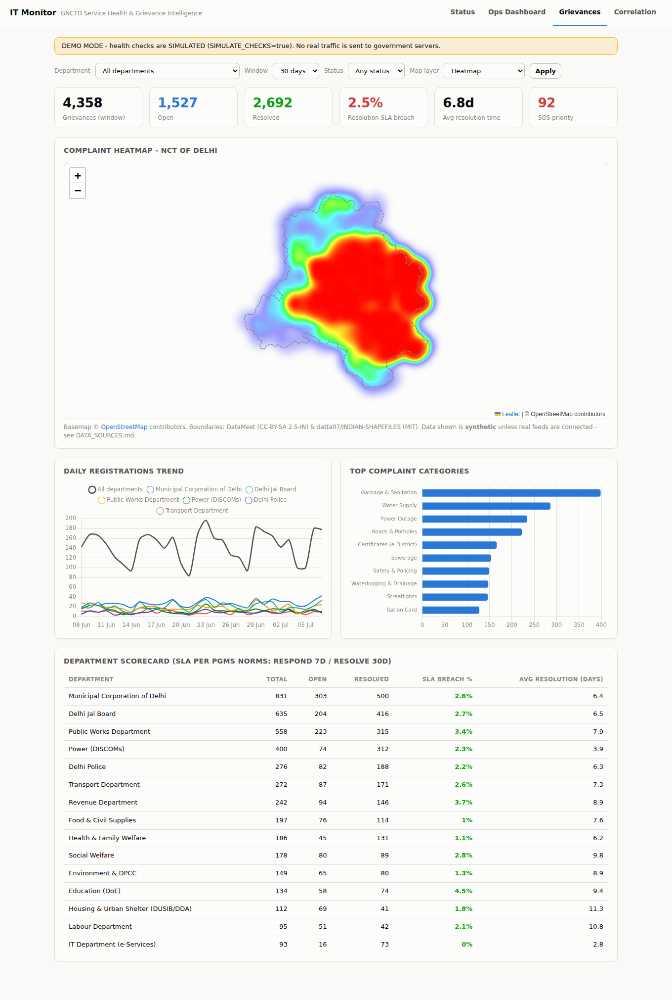
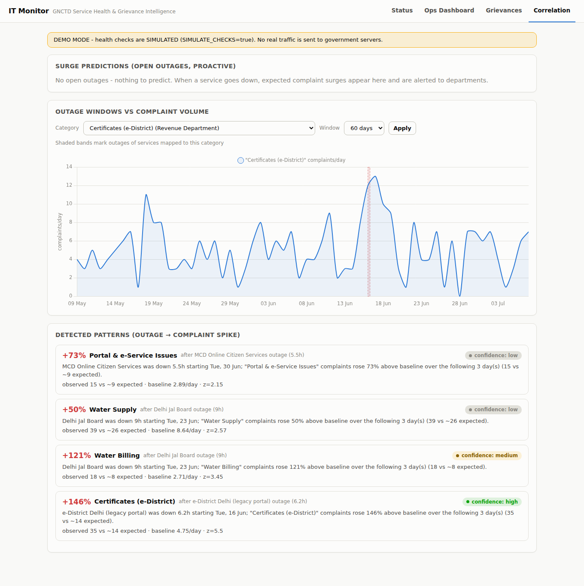

# IT Monitor

**GNCTD Service Health & Grievance Intelligence Platform**

A civic-tech platform for the Government of NCT of Delhi that answers two questions no
single dashboard answers today:

1. **Are our 500+ citizen-facing e-services actually up right now?**
2. **When they go down, what does it cost citizens - and can we see it coming?**

Built with Node.js, Express, MongoDB, Socket.io, Leaflet.js and Chart.js. Zero
procurement cost: every dependency is open-source and every external service used has a
free tier.

---

## The three modules

### Module 1 - e-Services Uptime & Health Monitor
- Cron-driven checks of **85 researched GNCTD/Delhi public service endpoints**
  (e-District, DJB, MCD, Transport, NFS ration, Delhi Police, DISCOMs, DORIS, all 11
  DM district sites... see [ENDPOINTS.md](ENDPOINTS.md)) every 5 minutes
- Tracks uptime %, latency, HTTP errors and **SSL certificate expiry**
- Public **status page** (statuspage.io-style) with 90-day uptime bars per service
- **Email alerts** (Nodemailer) + dashboard banner after 3 consecutive failed checks,
  recovery notices, SSL expiry warnings
- Live updates over **Socket.io**; polite probing (honest User-Agent, 10s timeout,
  exponential backoff on failing endpoints, small concurrency batches)

### Module 2 - Public Grievance Analytics & Heatmap
- Grievance ingestion API (single + bulk import) with **keyword-NLP auto-classification**
  into 15 departments / 39 categories modelled on PGMS Delhi complaint heads
- **Leaflet heatmap** of complaints over real Delhi boundaries, with cluster and
  district/ward **choropleth** layers (vendored GeoJSON - works offline)
- **SLA tracking** per PGMS norms (respond 7d / resolve 30d / SOS 3d), breach rates,
  resolution-time trends, department scorecard
- Ships with a **clearly-labelled synthetic dataset** (~12.5k grievances across 90 days,
  geolocated inside real ward polygons) until real PGMS/open-data feeds are connected

### Module 3 - Correlation Engine (the differentiator)
- Overlays **service outage windows on grievance timelines**
- Detects patterns like *"e-District down 6.2h Tuesday -> certificate complaints +146%
  above baseline over the next 2 days (z=5.5, high confidence)"* using transparent,
  auditable statistics (trailing-28-day baseline, Poisson z-score)
- **Predicts complaint surges from live outages** and proactively alerts departments
  *before* the complaints arrive

## Architecture

```
                    ┌──────────────────────────────────────────────────┐
                    │                   Browser UI                     │
                    │  status page · ops dashboard · heatmap · corr.   │
                    │        (Leaflet + Chart.js + Socket.io)          │
                    └──────────────▲──────────────────▲────────────────┘
                            REST   │                  │  websocket
┌───────────────┐   ┌──────────────┴──────────────────┴───────────────┐
│ GNCTD service │   │              Express + Socket.io                │
│ endpoints     │◄──┤  /api/services /api/status /api/grievances      │
│ (85 URLs,     │   │  /api/correlation /api/meta                     │
│  5-min cron)  │   ├─────────────────────────────────────────────────┤
└───────────────┘   │ Module 1        Module 2         Module 3       │
                    │ checker/ssl     classifier/sla   engine         │
                    │ scheduler       analytics        predictor      │
                    │ incidents ──► alerts (email + socket) ◄─────────┤
                    ├─────────────────────────────────────────────────┤
                    │                MongoDB (Mongoose)               │
                    │ services · checks(TTL) · daily rollups ·        │
                    │ incidents · grievances · alerts · insights      │
                    └─────────────────────────────────────────────────┘
```

## Screenshots

| Page | | 
|---|---|
| Public status page (`/`) |  |
| Ops dashboard (`/dashboard.html`) |  |
| Grievance heatmap (`/grievances.html`) |  |
| Correlation engine (`/correlation.html`) |  |

## Quick start

```bash
git clone <this-repo> && cd ITM
npm install
cp .env.example .env            # defaults work for local MongoDB

# start MongoDB locally (or point MONGODB_URI at Atlas M0 - see SETUP.md)

npm run seed                    # endpoints + 90d demo data + correlation insights
SIMULATE_CHECKS=true npm start  # demo mode: simulated probes, no real traffic
# open http://localhost:3000
```

For **real monitoring** (production): set `SIMULATE_CHECKS=false` (default) and run
`npm run seed:endpoints` instead of the full demo seed. See [SETUP.md](SETUP.md) and
[DEPLOYMENT.md](DEPLOYMENT.md).

## Repository map

```
server.js               entry point
src/
  config/               env config + Mongo connection
  models/               7 Mongoose schemas (see API.md)
  modules/monitor/      Module 1: checker, ssl, scheduler, incidents, simulator
  modules/grievance/    Module 2: keyword classifier, SLA rules, analytics
  modules/correlation/  Module 3: engine, surge predictor, schedules
  routes/  services/    REST API, Socket.io hub, Nodemailer
public/                 vanilla-JS UI (Leaflet/Chart.js vendored - no CDN)
data/endpoints.json     researched GNCTD endpoint catalogue (85 services)
data/geo/               real Delhi boundaries: 11 districts, 70 ACs, 290 wards
data/reference/         PGMS-style department/category taxonomy + keywords
scripts/                seeders, endpoint verifier, geodata fetcher
docs/                   executive brief, research findings
```

## Documentation

| File | Contents |
|---|---|
| [SETUP.md](SETUP.md) | Local install: Node, MongoDB, env, seeding, running |
| [DEPLOYMENT.md](DEPLOYMENT.md) | AWS EC2 free-tier deployment with PM2 + Nginx |
| [API.md](API.md) | Full REST + Socket.io API reference |
| [API_KEYS.md](API_KEYS.md) | Every optional key, where to get it, free-tier limits |
| [ENDPOINTS.md](ENDPOINTS.md) | The researched GNCTD endpoint list + verification status |
| [DATA_SOURCES.md](DATA_SOURCES.md) | All datasets, licences, what's synthetic |
| [CONTRIBUTING.md](CONTRIBUTING.md) | Conventions for contributors |
| [docs/EXECUTIVE_BRIEF.md](docs/EXECUTIVE_BRIEF.md) | One-page brief for the Joint Director (IT) |
| [docs/RESEARCH_FINDINGS.md](docs/RESEARCH_FINDINGS.md) | Autonomous research log & decisions |

## Responsible monitoring

This platform only sends the kind of request a citizen's browser sends when opening a
portal - one lightweight GET per service per 5 minutes (~288/day), with an honest
`User-Agent` identifying the monitor, strict timeouts, and automatic backoff (up to
60-min intervals) when a service is failing. No crawling, no authentication probing, no
load testing. Synthetic data is labelled `synthetic` end-to-end and never mixed silently
with real records.

## License

MIT (see LICENSE). Boundary data: DataMeet (CC-BY-SA 2.5-IN) and
datta07/INDIAN-SHAPEFILES (MIT) - attribution in [DATA_SOURCES.md](DATA_SOURCES.md).

---
*Built by Aman Vashishth - Intern, IT Department, GNCTD (Office of the Joint Director, IT).*
